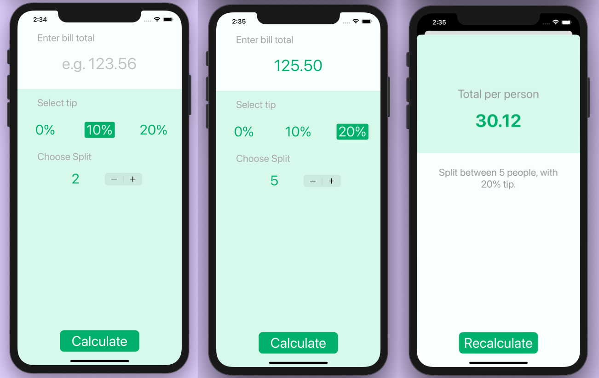

#  Tipsy

## What I created

 A bill splitting, tip calculating app. 
 Calculates and displays the total per person based on the total amount, tip rate, and number of people to split among. 

## What I learned

* How to create multi-screen apps with animated navigation.
* Optional binding, optional chaining and the nil coalescing operator.
* How to create classes and difference between classes and structs. 

>This is a companion project to The App Brewery's Complete App Development Bootcamp  [www.appbrewery.co](https://www.appbrewery.co/)

